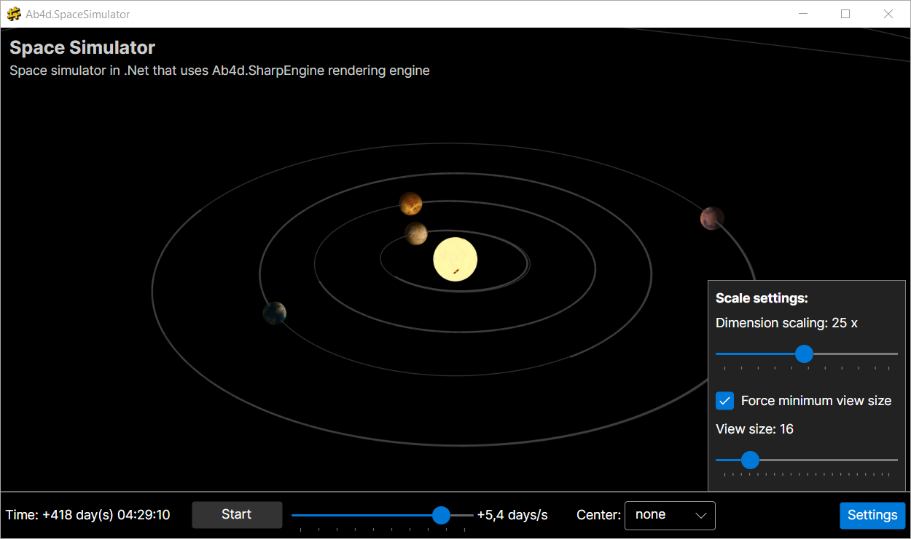

# Ab4d.SpaceSimulator

(Screenshots on different platforms: Windows, Ubuntu, macOS, Android, iPad)

Ab4d.SpaceSimulator is a simple solar system simulator that uses Newton's equation to calculate the gravitation force: 

F = (G * m1 * m2) / (r * r). 

This equation is enough to simulate the whole solar system with all the planets and the moons. 

The simulator uses a cross-platform [Ab4d.SharpEngine](https://www.ab4d.com/SharpEngine.aspx) rendering engine. This makes the simulator run on desktop (Windows, Linux, macOS) and mobile (Android, iOS) devices. 
See [Ab4d.SharpEngine.Samples GitHub page](https://github.com/ab4d/Ab4d.SharpEngine.Samples) for the samples that demonstrate the features of the engine.

The Ab4d.SpaceSimulator uses a free open-source license for Ab4d.SharpEngine. Because of this, the "POWERED BY SHARP ENGINE" message is shown when the app starts. To apply for your free open-source license use the [following page](https://www.ab4d.com/SharpEngineLicense.aspx?opensource=1).

NOTE:
This project is still in its early development form and has some issues. After those issues are fixed, we will be glad to accept PRs with new simulation scenarios and visual improvements.
